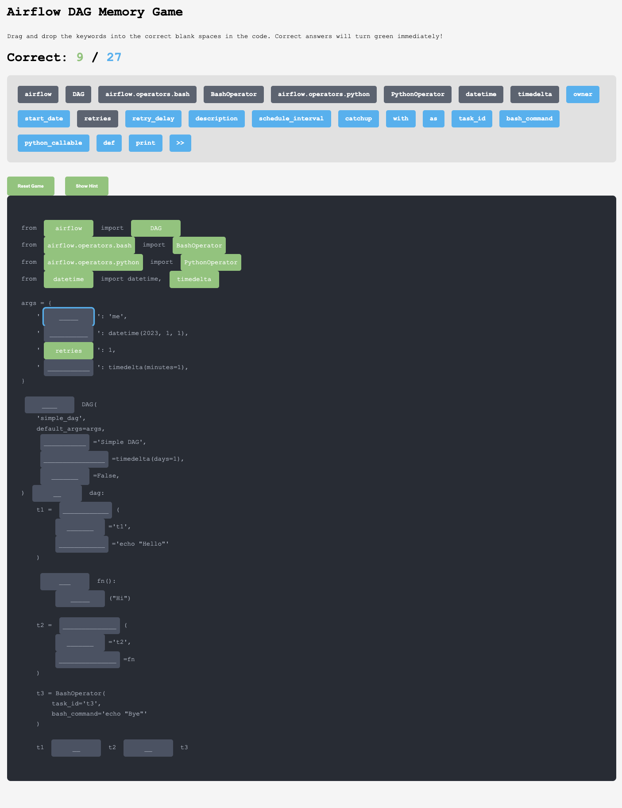

# Airflow DAG Memory Game

## Overview
This interactive memory game helps you practice and memorize the syntax for creating Directed Acyclic Graphs (DAGs) in Apache Airflow. By dragging and dropping keywords into the correct blank spaces in the code, you'll build muscle memory for Airflow's structure and syntax.

## How to Play
1. Examine the incomplete Airflow DAG code with blank spaces
2. Drag the keywords from the options at the top into the appropriate blank spaces
3. Correct answers will turn green immediately
4. Try to complete the entire DAG correctly

## What You'll Learn
- Proper imports for Airflow modules
- DAG configuration parameters
- Task definition syntax
- Operator usage (BashOperator, PythonOperator)
- Task dependencies and relationships

## Key Airflow Concepts Covered
- **DAG Structure**: Understanding how DAGs are defined and configured
- **Operators**: Learning the different types of operators (Bash, Python)
- **Task Parameters**: Setting up task properties like retries, retry_delay, and start_date
- **Task Dependencies**: Defining execution order with task relationships

## Why This Matters
Airflow is a powerful workflow management platform used extensively in data engineering and MLOps. Understanding how to correctly structure DAGs is essential for creating reliable, maintainable data pipelines. This game helps you internalize the syntax so you can focus on solving real data engineering problems rather than struggling with code structure.

## Next Steps
After mastering this basic DAG structure:
- Try creating more complex workflows with multiple dependencies
- Experiment with different operators
- Explore more advanced Airflow features like XComs, Sensors, and Hooks
